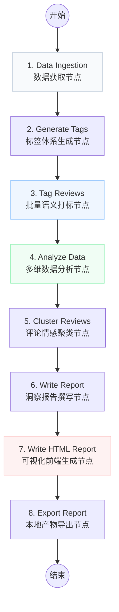

# Amazon Review Insight Agent 📊


**Amazon Review Insight Agent** 是一个基于 LangGraph 构建的多智能体工作流（Multi-Agent Workflow）项目。它旨在解决跨境电商运营中“评论分析耗时费力、分析维度单一、报告缺乏可视化”的痛点。

用户只需输入一个亚马逊商品的 ASIN（或本地 CSV 文件），系统便能自动完成从**数据爬取、标签体系构建、逐条语义打标、多维交叉分析、文本聚类**到**最终可视化 HTML 报告生成**的端到端全链路工作。

👉 **[在线查看自动生成的洞察报告大屏 ](https://growl-ai.github.io/amazon-review-analyst/result/report.html)** 


---

## ✨ 核心亮点 (Features)

- **🤖 多智能体协同 (Multi-Agent)**：利用 LangGraph 编排多个职责单一的 Agent（爬虫、标签生成、打标、数据分析、报告撰写、前端生成），流程清晰且易于扩展。
- **🏷️ 动态标签体系 (Dynamic MECE Schema)**：不依赖固定的硬编码标签，而是根据抓取的评论上下文，由大模型动态生成符合 MECE 原则的 4 级分析维度（人群与场景、功能价值、保障价值、体验价值）。
- **💾 健壮的断点续跑机制 (Resumable Tagging)**：针对长耗时的 LLM 批量打标节点，自研了基于 `run_key` 的缓存机制，支持 `--tagging-mode sequential` 逐条落盘，彻底解决因网络或 API 错误导致的进度丢失问题。
- **🎨 现代可视化大屏 (Beautiful HTML Dashboard)**：告别枯燥的纯文本 Markdown 报告，自动将分析数据结合 SVG 图表，交由大模型前端 Agent 输出深色科技感的 Tailwind CSS 网页。

---

## 🛠️ 技术栈 (Tech Stack)

- **AI 编排框架**：LangGraph, LangChain
- **大语言模型**：OpenAI API 兼容接口 (如 Qwen 阿里通义千问等)
- **数据抓取**：Firecrawl v2 SDK (支持动态网页与防反爬)
- **数据处理与图表**：原生 Python (结构化数据聚合)、SVG 动态渲染
- **前端可视化**：HTML5, Tailwind CSS CDN, FontAwesome

---

## ⚙️ 系统架构与 Agent 流程图 (Architecture)

本项目将复杂的分析任务拆解为 7 个标准的图节点（Nodes），形成有向无环图（DAG）流水线：



### 节点工作流详解：
1. **数据获取 (Data Ingestion)**：通过 Firecrawl API 抓取指定 ASIN 的评论，并在抓取受限时提供本地 CSV 兜底导入方案。
2. **标签生成 (Generate Tags)**：抽取部分样本评论，提示 LLM 生成多级 JSON 格式的结构化标签体系。
3. **批量打标 (Tag Reviews)**：核心算力节点。将每条评论与标签体系输入 LLM，进行细粒度分类映射。**（内置断点续跑与增量 Cache 功能）**
4. **数据分析 (Analyze Data)**：Python 原生处理，生成评分分布、高频标签、标签×星级交叉分析、时间趋势等，并生成对应的 SVG 图表。
5. **文本聚类 (Cluster Reviews)**：对好评和差评进行 K-Means 类似的主题聚类，提取典型原声（Voice of Customer）。
6. **撰写报告 (Write Report)**：基于上述量化统计结果，LLM 生成包含业务洞察与落地建议的 Markdown 报告。
7. **生成 HTML (Write HTML Report)**：模拟前端工程师角色，利用 Tailwind CSS 将 Markdown 报告转换为包含 SVG 图表占位符的深色数据大屏代码。
8. **产物导出 (Export Report)**：将 HTML、Markdown、分析表格及 CSV 原始打标数据落盘至 `output/` 目录。

---

## 🚀 快速开始 (Quick Start)

### 1. 环境准备
确保已安装 Python 3.10+，安装项目依赖：
```bash
# 在项目根目录执行
pip install -r requirements.txt
# 或者使用 pdm / poetry 等包管理工具
```

### 2. 配置环境变量
在根目录创建 `.env` 文件，填入必要的 API Keys：
```env
# LLM 接口配置 (默认使用阿里云 Dashscope)
DASHSCOPE_API_KEY=your_dashscope_api_key
DASHSCOPE_BASE_URL=https://dashscope.aliyuncs.com/compatible-mode/v1
DEFAULT_MODEL=qwen-max

# Firecrawl 爬虫配置
FIRECRAWL_API_KEY=your_firecrawl_api_key

# 运行模式: batch(并行) 或 sequential(串行落盘防断点)
TAGGING_MODE=sequential
```

### 3. 运行工作流
```bash
cd amazon-review-analyst
python src/main.py
```
运行结束后，所有生成的图表、Markdown 报告及最终的 HTML 看板均保存在 `output/` 目录下。

---

## 📂 目录结构 (Directory Structure)

```text
review-analyst/
├── graph.py            # LangGraph 工作流定义与节点实现 (核心入口)
├── tools.py            # 外部工具封装 (Firecrawl 爬虫与 CSV 导入)
├── prompt.py           # 统一的 LLM Prompt 提示词管理 (标签、打标、报告、HTML生成)
├── analysis.py         # Python 原生数据分析逻辑
├── clustering.py       # 评论文本聚类逻辑
├── charts.py           # 原生 SVG 图表生成工具
├── cache_store.py      # 断点续跑与本地 JSONL 缓存管理
├── report_export.py    # 产物落盘与 HTML/SVG 动态拼装
├── main.py             # 主程序入口，协调所有组件运行
└── output/             # 生成产物目录 (HTML大屏、MD报告、SVG图表)
```
